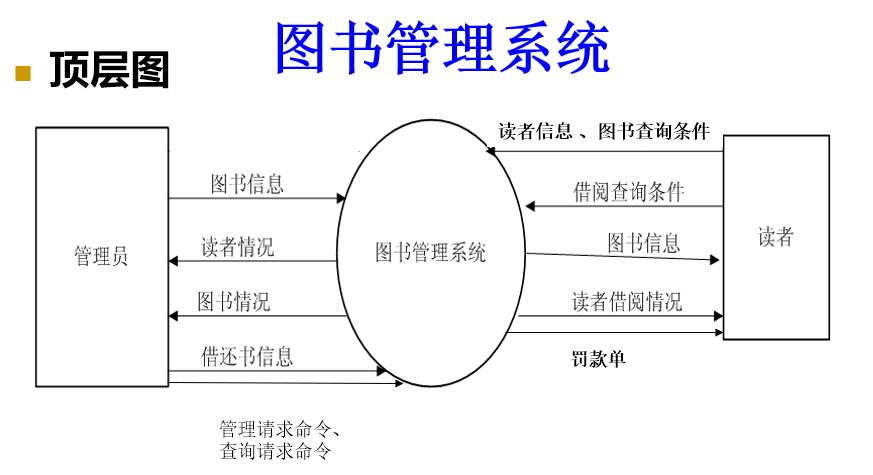

软件需求工程复习资料
=====
**说明:本repo仅作为个人复习使用，严禁用作其他用途，由此所带来的的后果与本人无关！**
tips:分层图就是关联图

## 第一章 (需求的分类、任务、定义)
### 软件需求的分类(功能需求，非功能需求)

<pre>
<code>
功能需求的三个层次:
    1.业务需求(最重要)
        业务需求是需求的驱动力，
        是需求的价值所在。需求
        的最终目的就是解决客 户
        的问题。

    2.用户需求
    3.系统需求
非功能需求的四个层次:
    1.性能需求
    2.质量属性
    3.对外接口
    4.约束
</code>
</pre>

### 需求工程的定义、软件需求的定义

<pre>
<code>
需求工程的定义:
指应用工程化的方法、技术和规格来开发和管理软件的需求。

软件需求的定义:
软件需求是指软件系统必须满足的所有功能、性质和限制
</code>
</pre>

### 需求工程的任务

<pre>
<code>
需求工程的主要任务:
    1.需求获取
    2.需求分析
    3.需求定义
    4.需求验证
</code>
</pre>

## 第二章 (对软件开发的影响、5个模型、需求工程的组成、)
### 需求工程对软件开发的影响

<pre>
<code>
（1）需求是制定项目计划的基础。
（2）需求工程所产生的最终产物——需求规格
         说明——是软件设计和软件实现的基础。
（3）需求规格说明也是测试工作和用户验收软
         件系统的依据。
（4）需求规格说明也是软件维护工作的依据。
</code>
</pre>

### 软件开发过程模型的种类，最早使用的软件开发过程模型是什么?

<pre>
<code>
软件开发过程模型的种类:
1.瀑布式模型
2.快速原型模型 
3.渐增式模型 
4.螺旋式模型 
5.面向对象的开发模型 

最早使用的是"瀑布式模型"
</code>
</pre>

### 需求工程的组成

#### 需求开发和需求管理两个阶段

<pre>
<code>
需求开发：主要产生正式的需求规格说明。
需求管理：主要是根据需求的变化对需求规格
         说明的内容及版本进行管理。 

</code>
</pre>

#### 需求开发可划分为:需求获取，需求分析，需求定义，需求验证四个阶段

<pre>
<code>
（1）需求获取：确定和收集与软件系统相关的、来自不同
              来源和对象的用户需求信息。

（2）需求分析：对获得的用户需求信息进行分析和综合 ， 
              并找出其中的错误、遗漏或其它不足的地
              方，以获得用户对软件系统的真正需求，建
              立软件系统的逻辑模型（或需求模型）。

（3）需求定义：使用适当的描述语言，按标准的格式描述
              软件系统的需求，并产生需求规格说明。

（4）需求验证：审查和验证需求规格说明是否正确和完整
              地表达了用户对软件系统的需求。
</code>
</pre>

## 第三章(需求获取、实地收集信息、案例分析:目标，范围，调查对象...)

### 需求获取阶段所做的工作包括哪些?

<pre>
<code>
1.确定需求开发计划
2.建立项目范围和目标
3.确定调查对象
4.实地收集用户需求信息
5.确定非功能需求和约束条件
</code>
</pre>

### 需求获取每个阶段的基本任务

<pre>
<code>
1.确定需求开发计划
    确定需求开发的实施步骤，并给出收集需求活动的具体安排和进度 。
2.建立项目范围和目标
    是根据项目目标把项目相关人员定位到一个共同的和明确的方向上，
    并决定软件系统的范围。 
3.确定调查对象
    基本任务是明确地确定来自不同层次的需求来源和用户，并将其分类。 
4.实地收集需求信息
    到现场实地调查和用户交流，收集和理解用户需求信息。 
5.确定非功能需求和约束条件
  

</code>
</pre>

### 针对实地收集需求信息可能面临的困难，写出解决方案

<pre>
<code>
实地收集需求信息可能面临的困难：
1、能提出软件需求的用户可能觉得他们没有充分的时间与开发人员进行交流和讨论 ；
      (预约时间）
2、有时用户希望通过简单的方法和说明，或者通过简单回答开发人员的询问后，软件
    开发人员就能清楚地理解他们的需求，而不需要花费太多的时间进行讨论；
     （抛砖引玉 ，尝试着问一些实际的问题，例如：“以我的理解，你们收到订单后
     ，会...”。 ）
3、用户和开发人员都只考虑自己的利益；如：有些用户由于缺乏使用计算机的经验，
    导致产生畏难情绪；有些用户认为开发软件系统自己的关系不大，对待需求信息的收
    集工作采取消极的态度。
    （给用户讲解使用软件的优点）
4、用户本身不能提出明确的需求。
     （以提问的方式引导用户或让用户描述手工管理过程）
5、开发人员缺乏用户的业务知识，而用户也缺乏计算机方面的知识，导致双方在交流
    中产生许多的困难，以至收集工作难以进行。
       （耐心讲解疑问）
</code>
</pre>

### 案例分析(软件系统，如：水利厅办公业务资源系统，课程管理系统，图书管理系统，校园通系统)，对于给出的案例，能写出系统的:业务目标，业务范围，能确定调查对象，实地获取需求信息时可采用的方法
#### 水利厅办公业务资源系统

<pre>
<code>

课程管理系统
目标
    开发课程管理系统，方便学生进行网上选课和成绩查询，节省教师、
    教务管理员的工作时间，提高课程管理效率。
范围
    教学管理系统用于新学期课程的选课注册管理和学生的成绩管理。
    凡是这两方面的教学管理内容都是系统的范围，其他的教学管理内
    容，如安排教学计划、排课、实习、实验、考试等都不属于系统的
    范围。至于学校的其他管理工作，如科研、人事、财务、资产等管
    理不属于系统的职责范围。
调查对象
    学生、老师、教学管理员和财务系统。

可采用的方法
    座谈会 （对于各类用户代表召开座谈会）
    个人面谈（各类用户代表获取功能需求）
    调查表（在获取末期对需求中存在的问题）
    用例（了解业务流程，如学生选课）

饭卡信息管理系统
目标： 
     为了方便学生、老师对饭卡进行管理，了解刷卡消费的情况和防止
     非法获得餐卡者恶意盗刷。提高食堂商户和财务管理人员对饭卡信
     息管理的工作效率。
范围：
     饭卡管理及饭卡消费信息管理
调查对象
（1）食堂商户
       查询自己当天的营业额。
（2）学生\老师
        随时查询自己的消费时间，消费地点以及消费金额，进行网上银行对自己的餐卡进行充值、挂失、注销，修改自己的餐卡的密码等相关信息。
（3）学校财务人员
       对饭卡进行管理，对饭卡充值、消费信息进行统计分析。
（4）同类软件
需求获取技术
    座谈会 （对于各类用户代表召开座谈会）
    个人面谈（各类用户代表获取功能需求）
    调查表（在获取末期对需求中存在的问题）
    参考考察（同类系统产品）

水利厅
    可采用的方法
        调查问卷
        用户访谈
        参考观察
（PPT上没详细的，参考上面的）

</code>
</pre>

#### 课程管理系统 

<pre>
<code>
确定调查对象
    可以确定4类调查对象:学生、老师、教学管理员和财务系统。
    “学生”使用系统查询新学期开设的课程信息和教师开课信息，选课并登记注册课程，
    查询自己的课程成绩信息。
    “老师”使用系统查询新学期开设的课程信息、学生选课信息和学生成绩信息。
    “教学管理员”使用系统管理学期开设的课程的选课注册和学生的考试成绩。管理工
    作包括课程与成绩数据的录入、维护、统计、报表打印等，并且负责把学生的选课
    注册信息发送给财务系统，作为计算学生应付费用的依据。“教学管理员”要求能够
    方便地查询课程信息、学生选课信息、学生信息、教师信息和成绩信息。
    “财务系统”参与者是外部系统参与者，从系统接受学生的课程注册信息。

</code>
</pre>

#### 太乱了，有空再整理吧(也可能不整理了)

## 第四章 (需求分析)
### 需求分析阶段的基本任务

<pre>
<code>
  软件需求分析的基本任务就是分析和综合己收集到的需求信息。其中分析的工作就在于
  透过现象看本质，找出这些需求信息间的内在联系和可能的矛盾。综合的工作就是去掉
  那些非本质的信息，找出解决矛盾的方法并建立系统的逻辑模型。 
</code>
</pre>

### 需求分析的具体工作(活动)包括哪些?

<pre>
<code>
（1）建立系统关联图
（2）分析需求的可行性
（3）构建用户接口原型
（4）确定需求的优先级别
（5）需求建模
（6）建立数据词典
</code>
</pre>

## 第五章 (结构化的需求建模方法、数据字典、数据流图/关联体图、序列图、OMT)
### 结构化的需求建模方法的特点、基本思想

<pre>
<code>
特点:
    （1）表达问题时尽可能使用图形符号的方式，这样即使
             非计算机专业人员也易于理解；
    （2）设计数据流图时只考虑系统必须完成的基本功能，
            完全不需要考虑如何具体地实现这些功能。 
基本思想:
    按照由抽象到具体、逐层分解的方法，确定软件系统内部的数据流、变换（或加工）的关系，并用数据流图给予表示。
</code>
</pre>

### 结构化的需求建模方法描述手段

<pre>
<code>
（1）一套分层的数据流图 
        主要说明系统由哪些部分组成，以及各部分之间的联系。
（2）一本数据词典 
         为数据流图中出现的每个元素提供详细的说明。
（3）其它补充材料
         具体的补充和修改文档的说明。 
</code>
</pre>

### 数据词典中包括哪些条目(每种条目命名规则)

<pre>
<code>
（1）数据流条目：
       用于定义数据流 ，主要说明由哪些数据项组成数据流，且
       数据流的定义也采用简单的形式符号方式。
        当数据项由多个更小的数据元素组成时，可利用集合
        符号“{ }”给予说明。
        当所有出现在DFD中的数据流都给予定义后，最后的
        工作就是对出现在数据流中的数据项进行汇总，然以
        表格的形式汇录每一数据项。
（2）文件条目：用于定义文件 
     文件条目除说明组成文件的所有数据项（与数据
        流的说明相同）外，还可说明文件的组成方式
（3）加工条目：用于说明加工
	 加工条目主要描述加工的处理逻辑或“做什么” 。
		加工条目并不描述具体的处理过程，但可以按处理的顺序描
        述加工应完成的一些功能，而且描述加工的手段通常使用自
        然语言，或者结构化的人工语言，或者使用判定表或判定树
        的形式。
</code>
</pre>

### 数据流图中应包括哪些元素，每种元素的表示符号

<pre>
<code>
1.数据流
    是由一组数据项组成的数据，通常用带标识的有向孤给予表示。
    数据流可以由单个数据项或多个数据项组成。
2.加工（变换） 
	对数据进行的操作或变换就称为加工。 通常用圆，椭圆或方框表示
3.文件
	文件是存放数据的逻辑单位，且通常用图形符号“__↘__”，“__↗__ ”
    和“  __↗↙__”分别表示加工要写文件，读文件和读写文件。或        
           表示。另外，在这个图形符号中还要给出文件名。 
    (这里打不出来，又不想放图，自己知道什么意思就行)
4.源点和终点
		源点和终点用于表示数据的来源和最终去向，且通常用图形方
        框给予表示。

</code>
</pre>

### 能画出患者监护系统、课程管理系统、图书管理系统、校园通系统的顶层数据流图(关联图)

<pre>

校园通系统待补充
</pre>

### 面向对象的需求建模方法(OMT)的建模步骤、建立的模型类型

<pre>
<code>
建模步骤
    1.构建对象模型
    2.构建动态模型
    3.构建功能模型
    4.定义类和对象中的操作
建立的模型类型
    （1）对象模型；
    （2）动态模型；
    （3）功能模型

</code>
</pre>

### 能编写在ATM取款机上取款、存款、转账和查询余额的场景或给出场景画出对应的序列图

<pre>

存款转账模拟一下，自己写吧，PPT上没
</pre>

### 能对点餐系统中顾客在线预约、取号、下单的用例进行描述

<pre>
<code>
用例图就是有小人那个图，

</code>
</pre>

### 能画出ATM系统、点餐系统的用例图

<pre>

</pre>

## 第六章 (需求规格说明、需求的正确性)
### 需求规格说明书的作用

<pre>
<code>
（1）需求规格说明是软件设计和实现的基础；
（2）需求规格说明是测试和用户验收软件系统
        的重要依据；
（3）需求规格说明能为软件维护提供重要的信
         息。

</code>
</pre>

### 需求规格说明书的版本的类型(标准)

<pre>
<code>
国际标准：适用于行业性软件。
国家标准：适用于国内稀有类行业软件。
部队标准：适用于军队开发的保密性软件。
</code>
</pre>

### 需求规格说明的描述语言主要有哪几种？最常用的是哪种语言?

<pre>
<code>
1.自然语言
2.形式化语言
3.结构化语言(最常用)
</code>
</pre>

### 分析下面的需求信息的正确性，如果存在问题，指出问题，并进行修正

<pre>
<code>
示例1
    “产品必须在固定的时间间隔内提供状态消息，并且每次时间间隔不得小
    于6 0秒”。

        存在的问题：
            这个需求是不完整的：什么是状态消息，并且在什么情况下向用户提供这
            些消息？小时显示时间多久？时间间隔不确切，应给出具体的间隔时间。
        更改：
            后台任务管理器（ B T M）应该在用户界面的指定区域显示状态消息。
            a. 在后台任务进程启动之后，消息必须每隔6 0（±1 0）秒更新一次，并
                且保持连续的可见性。
            b. 如果正在正常处理后台任务进程，那么后台任务管理器（ B T M）必须
                显示后台任务进程已完成的百分比。
            c. 当完成后台任务时，后台任务管理器（ B T M）必须显示一个“已完成”
                的消息。
            d. 如果后台任务中止执行，那么后台任务管理器（ B T M）必须显示一个
                出错消息。

示例2
    “如果可能的话，应当根据主货物编号列表在线确认所输入的货物编号。”

    存在的问题：
        “如果可能的话”这句话意味着什么？该需求是否在技术上可行？是否可以在线访问主货物编号列表？如果不能确信是否可以递交一个请求，那么就使用“待确   定” 来表   示未解决的问题。
        这个需求是不完整的，因为它并没有指明如果确认通过或失败，将会发生什么
        情况。
        应该尽量避免使用不精确的词汇，例如“应当”。客户可能需要这个功能或者
        不需要这个功能。一些需求规格说明利用关键字之间微妙的差别如“应当”，
        “必须”和“可能”来指明重要性。最好使用“必须”或“将要”来明确说明
        需求的目的并且明确指定其优先级。
    更改：
    “系统必须根据在线的主货物编号列表确认所输入的货物编号。如果在主列表
    中查不到该货物的编号，系统必须显示一个出错消息并且拒绝订货。”

示例3	

    操作员标识由操作员姓名和密码组成，密码由6位数字构成。当操作员登录进系统时它被存放在注册文件中。

    存在的问题：
        这个需求具有二义性。其中“它”到底代表“密码”还是“操作员标识”，不同的人往往有不同理解。
    更改：
        操作员标识由操作员姓名和密码组成，密码由6位数字构成。当操作员登录进系统时姓名和密码被存放在注册文件中。

示例5
	分析程序应该能生成HTML标记出错的报告，这样就可以使HTML的初学者使用它来迅速排错。
        存在的问题：
        （1）“迅速”这个词具有不确切性。
        （2）需求是不完整的。缺乏对出错误报告内容的定义。并且不知道什么情况下生成出错报告。
</code>
</pre>

## 第七章

## 第八章(需求验证、评审)
### 需求验证的目的，重要性，验证的内容、方法、任务

<pre>
<code>
重要性
    需求验证是需求开发的最后一项活动，它主要工作是
    检验软件系统相关的需求规格说明等文档，并使得这
    些文档中不能出现需求不完整或不一致等问题。

需求验证的目的
        确保需求规格说明具有良好的特性（如完整性，正确性等）。
任务
		要求各方人员从不同的技术角度对需求规格说明文档做出综合性评价。 
内容
    （1）一致性 
    （2）完整性
    （3）现实性
    （4）有效性 
方法
		 目前验证需求的方法除形式化方法外，主要靠人工技术审查和验证软件需求规格说明。 

</code>
</pre>

### 简述正式评审的过程

<pre>

</pre>

### 正式评审中审查人员的分类和职责

<pre>
<code>
（1）作者
    创建和编写需求规格说明书的人，这些人通常为系统分析员。他不参
    与讨论，只能听取其它审查员的评论，思考回答他们所提出的问题。
（2）调解员
    审查的调解和主持，通常为项目总负责人。与作者一起为审查制订计
    划，协调各种活动，并且推进审查会的进行。督促作者对规格说明做
    出建议性的更改，以保证向执行者明确说明在审查过程中提出的问题
    和缺陷。
（3）读者
    主要由审查人员扮演。在审查会进行期间，读者一次审查规格说明中
    的一块内容，并做出解释，而且允许其它审查员在审查时提出问题。
（4）记录员
    用标准化的形式记录在审查会中提出的问题和缺陷。记录员必须仔细
    审查所写的材料以确保记录的正确性。其它的审查员必须用有说服力
    的方式帮助录员抓住每个问题的本质，这一方法也使作者清楚地认识
    到问题的所在和本质。 
</code>
</pre>

### 给出需求评审会失败案例，能分析失败的原因

<pre>
<code>
需求评审失败的案例

1、某产品经理在主持需求评审会，评审开始时间不长，就被一位用户主管打断，明确指出此方案与企业业务发展方向不符，不能实施。紧接着其他与会人员纷纷发言表示同意，结果评审会无法继续进行，需求最终被否决。
    问题所在：
       需求获取时业务需求不明确或分析人员更改了用户业务需求而没
       有和用户进行协商

2、某次需求评审会，主要是软件公司内部相关领域的专家参加，在评审会开始后不久，某专家就对需求中的某个具体问题提出了自己的不同意见，于是，与会人员纷纷就该问题发表自己的意见，大家争执不下，结果，致使会议出现了混乱状况，调解员无法控制局面，会议大大超出了计划评审时间。
    问题所在：
        （1）需求存在二义性
        （2）评审小组结构不合理，缺少用户的参与
        （3）前期沟通和准备不够，缺乏应对不同意见的准备，难以化解争执。

3、某产品经理主持需求评审会，在讲解需求说明书时，与会人员似懂非懂，没有提出任何有价值的问题，致使会议没有得到预期效果，不得不改日重新进行。
    问题所在：
        （1）前期准备和沟通不够，缺少总体会议和准备工作。
        （2）没有选择合适的评审人员。

4、某需求评审会，与会人员各抒己见，气氛热烈，产品经理忙于收集意见，结果散会时发现对需求有价值的并不多，并且遗漏了许多要评审的问题，评审效果不佳。与会人员在离开会议室后，私下也认为评审没有多少实际效果，完全是在走过场。
    问题所在：
        （1）前期准备不够，没有审查清单、记录人员
           和调解员
        （2）没有选择合适的评审人员，无法获得有价
          值的信息。
</code>
</pre>

## 第九章 (需求管理、笨笨控制、变更状态)
### 通过需求验证的规格说明书成为基准规格说明书

<pre>
<code>

啥玩意儿？？
</code>
</pre>

### 需求管理的主要任务

<pre>
<code>
主要任务
    是开发人员在与提出变更的请求者（用户）协商的基础上，评估需求变更带
    来的潜在影响及可能的成本及费用；然后实施变更，以及有效地管规格说明
    文档和跟踪变更需求的状态。 
</code>
</pre>

### 需求管理的内容包括哪几个方面

<pre>
<code>
管理的内容
（1）控制对基准需求规格说明的变动；
（2）保持项目计划与需求一致；
（3）控制单个需求的更改和需求规格说明书的更改；
（4）管理需求和需求间的联系，以及需求与设计和实
          现等方面的依赖关系；
（5）跟踪需求变更的状态，控制多个需求同时变更的
         复杂性。 
</code>
</pre>

### 需求变更控制的策略

<pre>
<code>
2、变更控制策略
（1）建立所有需求变更所应遵循的过程（包括变更步
     骤）。按此过程，当一个变更需求在过程中的某
     一步被拒绝后，则其后步骤将不再予以考虑。
（2）对未获批准的变更，只进行可行性论证。
（3）对所提出的多个变更请求，应由项目变更控制委
     员会决定实现哪些变更，以及先后顺序。
（4）项目开发人员和用户应该能了解已变更需求的情况。
（5）不准随意删除和修改与需求变更请求和实现相关的原
     始文档。
（6）每一个实施后的变更必须与一个经核准的变更请求相
     对应。 
在实践中，小的需求变更请求可有开发人员决定，大的必须通过变更控制过程处理。

</code>
</pre>

### 需求规格说明文档的版本控制策略

<pre>
<code>
版本控制策略 
（1）专人修改（可减少冲突和不一致性）；
（2）版本应该包括修改版本的历史情况（修改的内容、
          修改的日期、修改人、修改原因等）；
（3）根据修改工作量的大小手工标记需求规格说明版本
           的每一次修改；
（4）每个版本的需求规格说明必须是独立说明的，以避
           免新旧版本的混淆。
      版本控制的最有力方法是用一个商业需求管理工具的数据
库存储需求。这些工具能跟踪和报告每个需求的变动历史，当
你需要恢复早期的需求时这很有价值。在添加、变动、删除、
拒绝一个需求后，附加一些评语描述变更的原因在将来需要讨
论时将会很有用。 

</code>
</pre>

### 需求变更的状态有哪些:提交、评估、变更、验证、结束

<pre>

</pre>

## 第十章

## 第十一章（问题域、问题框架）
### 问题域的定义，问题域与问题的关系

<pre>
<code>
问题域定义
	与问题相关的部分现实世界。
      包括：所有与描述期望效果有关的事物，用来产生效果
      的方法。用户需求可视为通过计算机程序在问题域中施
      加的效果，这些效果是对用户预期的描述。用户需求中
      的每一个术语都代表了问题域中的相应事物。

问题与问题域之间的相互关系
		问题域和问题相互依存，问题处于一定的问题域之中，
        脱离了问题域，问题就无法存在。问题域也是与特定
        的问题相关的现实世界，脱离特定的问题考虑纯粹的
        问题域没有任何意义

</code>
</pre>

### 问题框架的组成，类型有哪些

<pre>

<code>
类型:
    1、需求式行为问题框架 
    2、命令式行为问题框架（受控行为框架）
    3、信息显示问题框架
    4、工件问题框架
    5、变换问题框架
</code>
</pre>

### 面向问题域的需求分析方法的步骤

<pre>
<code>
步骤
（1）搜集需求信息，界定和描述问题及问题域； 
（2）划分问题域并开发相关问题框架； 
（3）根据问题框架的类型进一步描述问题域的相关特性。 
</code>
</pre>

### 能画出旋转栅门控制系统、校园通系统的问题框架图

<pre>

</pre>

### 能对校园通系统对应的问题域进行并行划分，能写出划分的子问题

<pre>
<code>
划分的方法：

（1）由内到外的划分
        问题及其问题域存在一个比较明显的核心，从这个核心出发，
        通过逐步向外扩展的方式来分析和划分问题及其问题域。
    （核心：家长通过电话查询学生的在校表现与信息显示框架相匹配） 

（2）由外到内的划分
        适用于整个问题及其问题域似乎没用一个合适的问题框架相匹配。
        划分时，先对问题的某一部分进行划分，之后在考虑剩余问题及
        其问题域的划分。
    （如：管理员依据学校的有关规定设置考勤制度与工件系统相匹配）

（3）基于节奏的划分
       当问题需求的一部分处于满节奏，而另一部分处于快节奏时，可以
       考虑将它们划分为不同的子问题。在这种情况下，通常存在一个公
       共的域必须在快的子问题中处理为动态的，而在慢的子问题中处理
       为静态的。 
    （如：刷卡记录和考勤报表的关系）

系统可划分为以下几个子问题：
1、系统记录刷卡学生的信息
2、系统通过短信网关将学生的刷卡信息以短信的形式发到学生家长的手机
3、教师可在系统中输入学生校表现信息
4、教师通过系统以短信的形式给学生家长发送各种信息
5、管理员可在系统中输入考勤规则
6 、系统根据考勤规则定时汇总学生的刷卡记录和请假记录，生成学生的考勤报表
7、教师可在系统中输入学生请假记录
8、家长可通过电话查询学生的各类在校表现

</code>
</pre>

